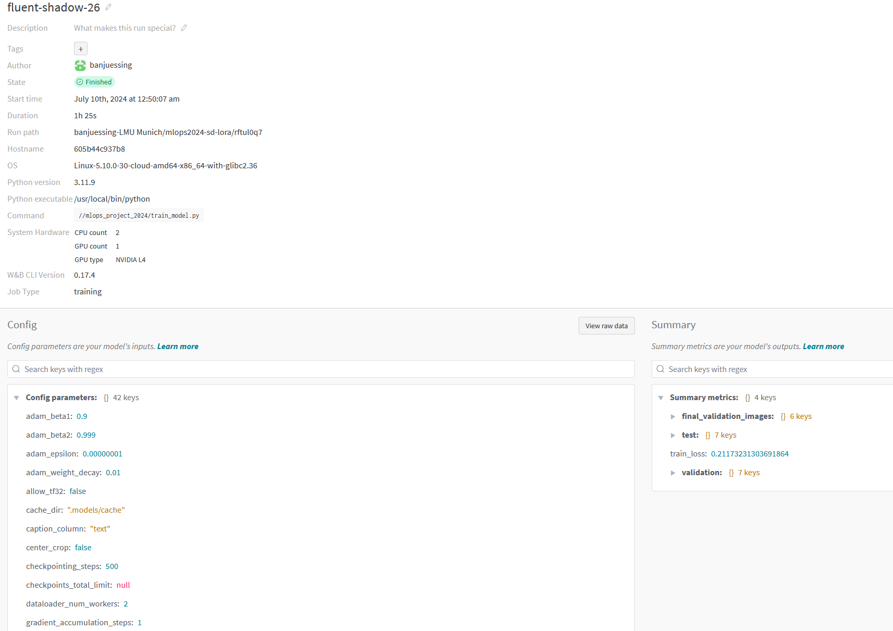
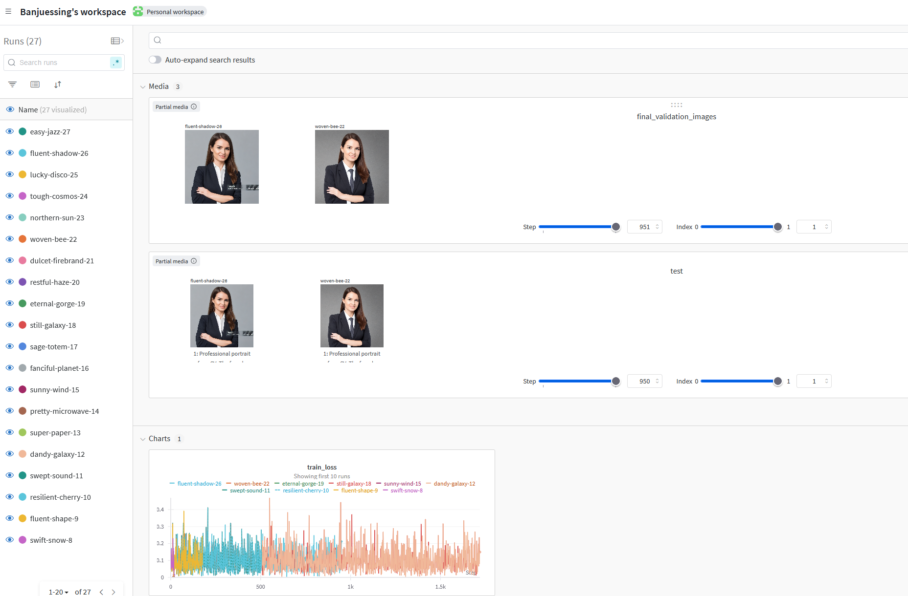
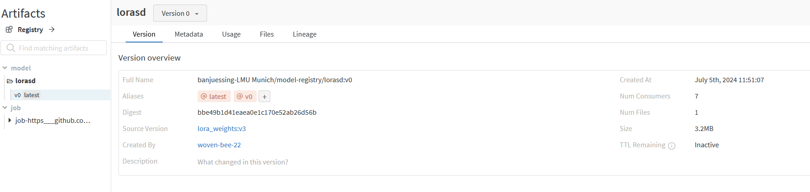
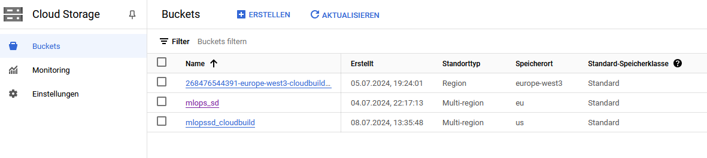
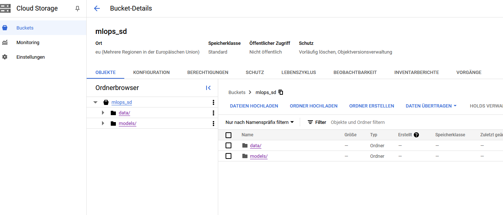
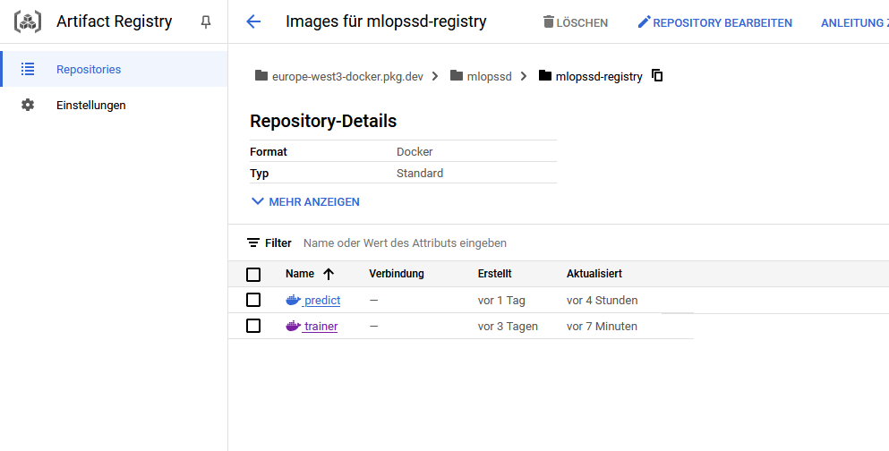
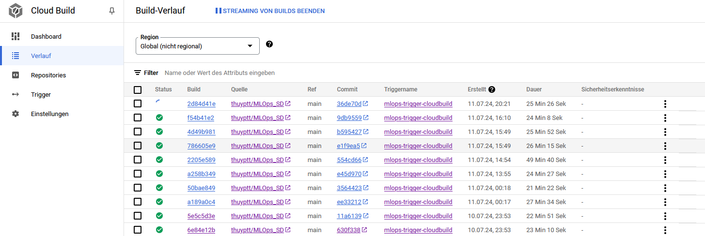
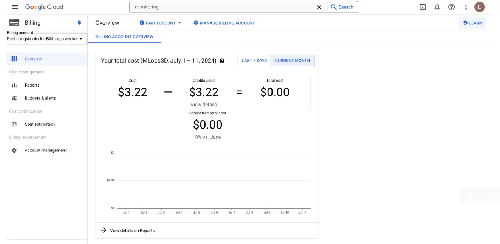
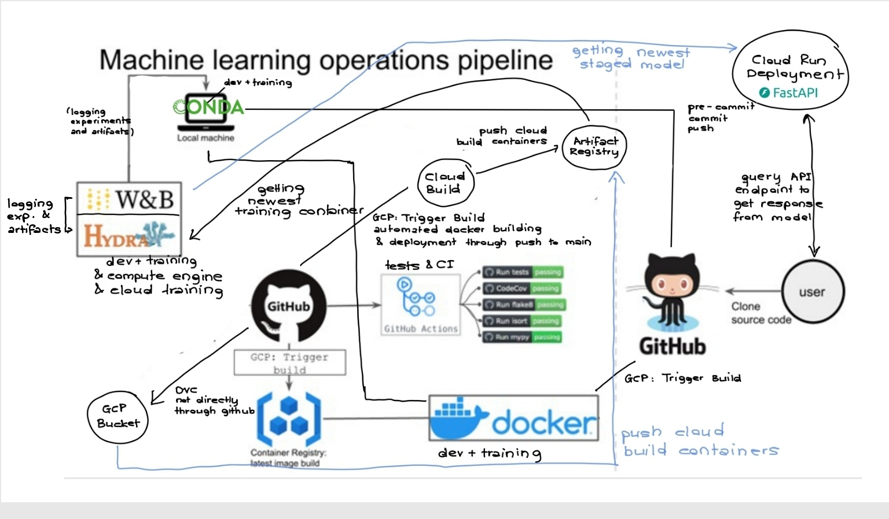

# Exam template for 02476 Machine Learning Operations

This is the report template for the exam. Please only remove the text formatted as with three dashes in front and behind
like:

```--- question 1 fill here ---```

where you instead should add your answers. Any other changes may have unwanted consequences when your report is
auto-generated at the end of the course. For questions where you are asked to include images, start by adding the image
to the `figures` subfolder (please only use `.png`, `.jpg` or `.jpeg`) and then add the following code in your answer:

```markdown

```

In addition to this markdown file, we also provide the `report.py` script that provides two utility functions:

Running:

```bash
python report.py html
```

will generate a `.html` page of your report. After the deadline for answering this template, we will auto-scrape
everything in this `reports` folder and then use this utility to generate an `.html` page that will be your serve
as your final hand-in.

Running

```bash
python report.py check
```

will check your answers in this template against the constraints listed for each question e.g. is your answer too
short, too long, or have you included an image when asked to.

For both functions to work you mustn't rename anything. The script has two dependencies that can be installed with

```bash
pip install click markdown
```

## Overall project checklist

The checklist is *exhaustive* which means that it includes everything that you could do on the project included in the
curriculum in this course. Therefore, we do not expect at all that you have checked all boxes at the end of the project.

### Week 1

* [X] Create a git repository
* [X] Make sure that all team members have write access to the GitHub repository
* [X] Create a dedicated environment for you project to keep track of your packages
* [X] Create the initial file structure using cookiecutter
* [X] Fill out the `make_dataset.py` file such that it downloads whatever data you need and
* [X] Add a model file and a training script and get that running
* [X] Remember to fill out the `requirements.txt` file with whatever dependencies that you are using
* [X] Remember to comply with good coding practices (`pep8`) while doing the project
* [X] Do a bit of code typing and remember to document essential parts of your code
* [X] Setup version control for your data or part of your data
* [X] Construct one or multiple docker files for your code
* [X] Build the docker files locally and make sure they work as intended
* [X] Write one or multiple configurations files for your experiments
* [X] Used Hydra to load the configurations and manage your hyperparameters
* [] When you have something that works somewhat, remember at some point to to some profiling and see if
      you can optimize your code
* [X] Use Weights & Biases to log training progress and other important metrics/artifacts in your code. Additionally,
      consider running a hyperparameter optimization sweep.
* [ ] Use Pytorch-lightning (if applicable) to reduce the amount of boilerplate in your code

### Week 2

* [X] Write unit tests related to the data part of your code
* [X] Write unit tests related to model construction and or model training
* [X] Calculate the coverage.
* [X] Get some continuous integration running on the GitHub repository
* [X] Create a data storage in GCP Bucket for you data and preferable link this with your data version control setup
* [X] Create a trigger workflow for automatically building your docker images
* [X] Get your model training in GCP using either the Engine or Vertex AI
* [X] Create a FastAPI application that can do inference using your model
* [X] If applicable, consider deploying the model locally using torchserve
* [ ] Deploy your model in GCP using either Functions or Run as the backend

### Week 3

* [ ] Check how robust your model is towards data drifting
* [ ] Setup monitoring for the system telemetry of your deployed model
* [X] Setup monitoring for the performance of your deployed model
* [ ] If applicable, play around with distributed data loading
* [ ] If applicable, play around with distributed model training
* [ ] Play around with quantization, compilation and pruning for you trained models to increase inference speed

### Additional

* [X] Revisit your initial project description. Did the project turn out as you wanted?
* [X] Make sure all group members have a understanding about all parts of the project
* [X] Uploaded all your code to github

## Group information

### Question 1
> **Enter the group number you signed up on <learn.inside.dtu.dk>**
>
> Answer:

Stable Diffusion group

### Question 2
> **Enter the study number for each member in the group**
>
> Example:
>
> *sXXXXXX, sXXXXXX, sXXXXXX*
>
> Answer:

Student A
Student B
10977040 Thi Thuy Pham
Student C

### Question 3
> **What framework did you choose to work with and did it help you complete the project?**
>
> Recommended answer length: 100-200 words.
>
> Example:
> *We used the third-party framework ... in our project. We used functionality ... and functionality ... from the*
> *package to do ... and ... in our project*.
>
> Answer:

We used a combination of several third-party frameworks and libraries in our project, which proved essential in completing various tasks. Specifically, we used the diffusers, accelerate, and peft packages for LoRA (Low-Rank Adaptation) training. Additionally, the transformers package, which is also a dependency of diffusers, was involved in handling for example tokenization of image captions. These frameworks helped manage both the inference and training processes effectively.

For image handling, we relied on pillow and torchvision, while PyTorch was used for the core training tasks. The diffusers and accelerate packages were integral in managing the inference phase, ensuring efficient execution on different hardware environments.
We utilized the datasets library to save and load datasets, facilitating data preprocessing and transformation.

Overall, these frameworks and libraries provided robust support for image & dataset processing and efficient parameter tuning, significantly contributing to the project's success. Ultimately, we achieved our aim of fine-tuning a pretrained diffusion model using PEFT strategies like LoRA and utilizing its image-to-image capabilities to generate professional CV pictures based on uploaded photos.


## Coding environment

> In the following section we are interested in learning more about you local development environment.

### Question 4

> **Explain how you managed dependencies in your project? Explain the process a new team member would have to go**
> **through to get an exact copy of your environment.**
>
> Recommended answer length: 100-200 words
>
> Example:
> *We used ... for managing our dependencies. The list of dependencies was auto-generated using ... . To get a*
> *complete copy of our development environment, one would have to run the following commands*
>
> Answer:

We managed our project dependencies using Conda, PyPI, Docker, pipreqs, and Git. We created a Conda environment to ensure isolation of dependencies. Conda managed the environments, while PyPI handled the package installations. We used pipreqs to generate an initial requirements.txt file, and additional requirements were added by team members. We also exported an environment.yml file for Conda with conda env export > environment.yml.

To replicate our environment exactly, team members would build the Docker image.

The Dockerfile includes the requirements.txt file and the environment where the training and prediction part of the project can run, ensuring consistency.

Version control was handled with Git. New team members are invited to the GitHub repository, where they can clone the project:


git clone repository_url

They can then build the Docker image using the provided Dockerfile. Another option would be to create a new environment or clone the Conda environment using the requirements.txt or environment.yml files to have it locally on their own OS if Docker isn't an option. This setup ensures a consistent development environment across the team, minimizing dependency conflicts.


### Question 5

> **We expect that you initialized your project using the cookiecutter template. Explain the overall structure of your**
> **code. Did you fill out every folder or only a subset?**
>
> Recommended answer length: 100-200 words
>
> Example:
> *From the cookiecutter template we have filled out the ... , ... and ... folder. We have removed the ... folder*
> *because we did not use any ... in our project. We have added an ... folder that contains ... for running our*
> *experiments.*
> Answer:

To start our project, we used cookiecutter to create a custom MLOps template and pushed it to the main branch. Each project member could then create a side branch from the main branch with this template and use it as a common starting point to work on our first tasks. The template helped us have a structured and organized project with fewer merging conflicts from the very beginning and avoid unintentionally storing our files in different folders with possibly different folder names, although the uploaded files should belong together in one folder.

From the cookiecutter template we have filled out the following folders:.github/workflows, data, dockerfiles, models, notebooks, reports, tests and project folder. We have either edit some files in those folders or we added new files into those folders.  

The .github/workflows folder contains all yaml files to run several common tests on our code to improve the code quality in general. 

The data folder includes image data which are used as input to train our LoRA model.

In the dockerfiles folder we stored the adjusted predict_model.dockerfile file.

The models folder contains a safetensors file for saving and exchanging developed ML models.

Notebooks about the process of training, inference on the trained LoRA model and cloud build are kept in the notebooks folder.

The reports folder includes our project's report.

The tests folder serves as a storage place for all the unit tests related to data, model  and API.
 
The project folder contains a subfolder config with all necessary configuration files used for our project. Besides that it also contains files to train and predict the LoRA model/inference with fastapi. The data subfolder is used for storing the adjusted make_dataset.py file. We didn't use the model folder as we finetuned a pre-trained model. Also we didn't make any visualizations.

We have added a .devcontainer and a .dvs folder which contains the link from DVC to GCS. 

Our file structure, along with explanations, can also be found in the README of our repository. There we marked also unused sections.


### Question 6

> **Did you implement any rules for code quality and format? Additionally, explain with your own words why these**
> **concepts matters in larger projects.**
>
> Recommended answer length: 50-100 words.
>
> Answer:

We implemented all typical used rules like ruff, pytest, mypy, autopep8 and flake8 to level up the whole coding process. All these tools are in general useful for us to ensure that our Python code is well tested, type-safe, cleanly formatted to meet Pep8 standards and of high quality.

In larger projects such concepts are crucial  and indispensable as they promote code quality, reliability, clarity, efficiency, and collaboration among developers. By integrating these practices into the development workflow, teams can effectively manage complexity, reduce errors, and deliver robust software solutions that meet both functional and non-functional requirements. 

## Version control

> In the following section we are interested in how version control was used in your project during development to
> corporate and increase the quality of your code.

### Question 7

> **How many tests did you implement and what are they testing in your code?**
>
> Recommended answer length: 50-100 words.
>
> Example:
> *In total we have implemented X tests. Primarily we are testing ... and ... as these the most critical parts of our*
> *application but also ... .*
>
> Answer:

We implemented 7 tests for our project. These tests cover various aspects of our data processing and model components to ensure reliability and correctness.
In the data tests, as an example, we verified that the tokenize_captions function correctly handles individual string captions and matches the expected output shape. Additionally, we confirmed that the tokenize_captions function raises a ValueError when an invalid caption type is provided. For the model tests, we ensured that the configuration for training is loaded correctly and that the model components are initialized properly using the pre-trained paths.

### Question 8

> **What is the total code coverage (in percentage) of your code? If you code had an code coverage of 100% (or close**
> **to), would you still trust it to be error free? Explain you reasoning.**
>
> Recommended answer length: 100-200 words.
>
> Example:
> *The total code coverage of code is X%, which includes all our source code. We are far from 100% coverage of our **
> *code and even if we were then...*
>
> Answer:

We achieved 87% code coverage on our data processing. However, even if we had 100% code coverage, it wouldn't mean the code is completely error-free. Code coverage shows how much of the code is tested, but it doesn't ensure that all logical paths, edge cases, and potential bugs are addressed. Code can pass tests but still fail in unexpected ways under untested conditions. So, while high coverage is good, we also need thorough testing and careful code reviews to ensure the code is reliable and works well in all cases.

### Question 9

> **Did you workflow include using branches and pull requests? If yes, explain how. If not, explain how branches and**
> **pull request can help improve version control.**
>
> Recommended answer length: 100-200 words.
>
> Example:
> *We made use of both branches and PRs in our project. In our group, each member had an branch that they worked on in*
> *addition to the main branch. To merge code we ...*
>
> Answer:

We utilized both branches and pull requests (PRs) in our project. At first we created branches for each member so that everyone could work and execute their assigned tasks on their respective Git branch. Later, additional branches for different tasks were created. If the code on the respective branches was deemed useful and ready, we initiated a pull request. Subsequently, at least one team member reviewed the code, checked for potential merging conflicts and resolved them before merging it with the main branch. 

Instead of cloning the Git repository to their local machine some members also opted to fork  the repository, complete their assigned tasks on the forked repository and then directly upload their created files to the appropriate folder on the main branch of the Git repository provided for the project. However, this approach was not always optimal as it sometimes required manual bug fixes to ensure compatibility of the newly uploaded files with the rest of the Git repository.

### Question 10

> **Did you use DVC for managing data in your project? If yes, then how did it improve your project to have version**
> **control of your data. If no, explain a case where it would be beneficial to have version control of your data.**
>
> Recommended answer length: 100-200 words.
>
> Example:
> *We did make use of DVC in the following way: ... . In the end it helped us in ... for controlling ... part of our*
> *pipeline*
>
> Answer:

Yes, we have downloaded professional resume photos from online sources, we added captions for each image. At first we used Google Drive as the remote storage solution for the cv images. DVC will just keep track of a small metafile, then point to the google drive folder we created. Then we use the GCP bucket. We implemented dvc, but didnt use it extensively during our project due to our smaller and not changing data. So it's more important for setups with huge amounts and changing data. In general, Using the data version control is especially  important, team members can divide tasks, changing the data and working on their part without hindering other members. So all these changes will be tracked. During the project we will have a clear overview of the changes. If something happens, we can go back to the earlier version again. This is also beneficial for cross- check between team members. Team members can check the GCP bucket to reproduce the results from other members and give advice when the member has problems. In total, data changes are transparent, clear with reproducibility.  The data version control is essential and  efficient for Project collaboration.

### Question 11

> **Discuss you continuous integration setup. What kind of continuous integration are you running (unittesting,**
> **linting, etc.)? Do you test multiple operating systems, Python  version etc. Do you make use of caching? Feel free**
> **to insert a link to one of your GitHub actions workflow.**
>
> Recommended answer length: 200-300 words.
>
> Example:
> *We have organized our continuous integration into 3 separate files: one for doing ..., one for running ... testing*
> *and one for running ... . In particular for our ..., we used ... .An example of a triggered workflow can be seen*
> *here: <weblink>*
>
> Answer:

To implement Continuous Integration in our pipeline we made use of GitHub actions provided by GitHub. We use GitHub workflow to automatically test our python code for unwanted bugs, the coding style and complex code structure, to test if we meet the good coding practices from the ruff framework, to execute all the defined unit tests related to data, model  and API which are stored in the tests folder and finally to test if we used the correct types.

We use one GitHub trigger for pull requests before merging to the main branch. Especially we set up a merging condition which requires a status check for code formatting to pass before the ref is updated.

All tests in the GitHub workflow folder can be executed on the three main operating systems windows, ubuntu and mac os but is only runnable on Python version 3.11 since we all together agreed on setting up all our code in a virtual environment using Python 3.11.

The workflows can be found here: 

<https://github.com/thuyptt/MLOps_SD/tree/main/.github/workflows>

## Running code and tracking experiments

> In the following section we are interested in learning more about the experimental setup for running your code and
> especially the reproducibility of your experiments.

### Question 12

> **How did you configure experiments? Did you make use of config files? Explain with coding examples of how you would**
> **run a experiment.**
>
> Recommended answer length: 50-100 words.
>
> Example:
> *We used a simple argparser, that worked in the following way: Python  my_script.py --lr 1e-3 --batch_size 25*
>
> Answer:

We configured our experiments using config files, which we managed with Hydra. The config files, such as default_config.yaml, stored hyperparameters, data paths, and other settings. For new experiments, we modified the existing config file or created new ones. In the training script, we specified the path to the desired config file. By consolidating relevant configurations for training, prediction, and dataset creation in a single template, we ensured consistency throughout the pipeline.

Example to change config used inside the train.py.

Inside train_model.py:

@hydra.main(config_path="./config", config_name="default_config.yaml", version_base=None)
def main(cfg):

This approach maintained uniformity and simplified experiment management.

### Question 13

> **Reproducibility of experiments are important. Related to the last question, how did you secure that no information**
> **is lost when running experiments and that your experiments are reproducible?**
>
> Recommended answer length: 100-200 words.
>
> Example:
> *We made use of config files. Whenever an experiment is run the following happens: ... . To reproduce an experiment*
> *one would have to do ...*
>
> Answer:

We ensured the reproducibility of our experiments using config files managed by Hydra and by implementing comprehensive logging with Weights & Biases (W&B). Whenever an experiment was run, the training loss, hyperparameters, and other configurations (entire config file) were logged. Validation metrics and intermediate outputs, such as generated images between epochs, were also recorded. Since our project involved fine-tuning a LoRA for a stable diffusion model, we focused on qualitative assessments (generated images) rather than objective performance metrics.

Additionally, the final trained model was logged as an artifact in W&B. To reproduce an experiment, one would refer to the logs in W&B to retrieve all necessary information, including hyperparameters, training configurations, and model artifacts. This approach allows for easy comparison of different runs and assessment of model quality, ensuring no information is lost and experiments are fully reproducible.

### Question 14

> **Upload 1 to 3 screenshots that show the experiments that you have done in W&B (or another experiment tracking**
> **service of your choice). This may include loss graphs, logged images, hyperparameter sweeps etc. You can take**
> **inspiration from [this figure](figures/wandb.png). Explain what metrics you are tracking and why they are**
> **important.**
>
> Recommended answer length: 200-300 words + 1 to 3 screenshots.
>
> Example:
> *As seen in the first image when have tracked ... and ... which both inform us about ... in our experiments.*
> *As seen in the second image we are also tracking ... and ...*
>
> Answer:






In our project, we tracked several key metrics using W&B to monitor and evaluate our experiments. Our focus was on tracking training loss, configuration settings, and visual outputs, all of which are critical for understanding and improving our model's performance.
Tracking the training loss was essential for assessing how well our model was learning over time. Although the training loss exhibited significant fluctuations, this information was still valuable for identifying potential issues such as overfitting or underfitting. Monitoring the loss helped us make necessary adjustments to the training process and improve model stability.
We meticulously tracked the entire configuration file used for each experiment. This included hyperparameters like learning rate, batch size, and other environment-specific parameters. By keeping detailed records of these configurations, we ensured that our experiments were reproducible and that we could understand the impact of different settings on the model's performance. This systematic approach to experimentation allowed us to refine our model efficiently based on empirical evidence.
Visual outputs generated during the training process, as well as final validation images, were also tracked. Since our task involved training a LoRA (Low-Rank Adaptation) for a pre-trained Stable Diffusion model, we relied on these visual outputs to qualitatively evaluate the model's performance. Even without an objective error/performance metric, these images provided crucial insights into the quality of the generated content and helped us identify areas for improvement.
Additionally, we used W&B to manage and version the fine-tuned LoRA files as artifacts. This capability was instrumental in organizing our models and ensuring that the best-performing versions were easily accessible for deployment. Trained models can be staged into the artifact registry, from where it could be deployed to the cloud.


### Question 15

> **Docker is an important tool for creating containerized applications. Explain how you used docker in your**
> **experiments? Include how you would run your docker images and include a link to one of your docker files.**
>
> Recommended answer length: 100-200 words.
>
> Example:
> *For our project we developed several images: one for training, inference and deployment. For example to run the*
> *training docker image: `docker run trainer:latest lr=1e-3 batch_size=64`. Link to docker file: <weblink>*
>
> Answer:

In our experiments, Docker has been essential for streamlining both the training and inference phases of our machine learning models, ensuring consistency, reproducibility, and scalability across various computing environments. During the training phase, we built a Docker container set up by our train_model.dockerfile. This container includes all necessary tools for model training and library requirements. By using Docker, we maintain a uniform environment that avoids issues related to different library versions or operating system inconsistencies that often occur across various development setups. For inference, we use a different Docker setup optimized for quick deployment and minimal resource use. This Docker setup focuses on running the model efficiently which is critical for the real-time processing demands of inference operations, handling web requests, and delivering predictions through our FastAPI application.  We first built docker images and containers locally for building local API. As the project progresses towards deployment, we transition to using Google Cloud Build for building our Docker containers. Those cloudbuild docker containers are then also used for continuous deployment of trained models and model training in the cloud.

building docker image:
 docker build -f dockerfiles/predict_model.dockerfile -t predict:latest .
training docker image: 
 docker run -d -p 8000:8000 --name predict :latest

Link to docker file:
<https://github.com/thuyptt/MLOps_SD/blob/main/dockerfiles/predict_model.dockerfile>


### Question 16

> **When running into bugs while trying to run your experiments, how did you perform debugging? Additionally, did you**
> **try to profile your code or do you think it is already perfect?**
>
> Recommended answer length: 100-200 words.
>
> Example:
> *Debugging method was dependent on group member. Some just used ... and others used ... . We did a single profiling*
> *run of our main code at some point that showed ...*
>
> Answer:

When we encountered bugs, we followed a systematic debugging process. We reviewed error messages to identify the source of the problem. Additionally, we used print statements and error handling to make issues more understandable and reproducible. Small sections of the code were tested independently before running the entire script. Initially, everything was tested locally and within Docker to ensure compatibility before deploying it to the cloud. We leveraged resources like Google, documentation, and ChatGPT for additional help.
We did not perform explicit code profiling or reduce boilerplate. Instead, we used high-level API packages like Diffusers and Accelerate, which are designed to handle performance optimization and reduce boilerplate code out of the box. This approach allowed us to focus more on functionality and less on manual optimization.


## Working in the cloud

> In the following section we would like to know more about your experience when developing in the cloud.

### Question 17

> **List all the GCP services that you made use of in your project and shortly explain what each service does?**
>
> Recommended answer length: 50-200 words.
>
> Example:
> *We used the following two services: Engine and Bucket. Engine is used for... and Bucket is used for...*
>
> Answer:

We used multiple GCP services: Compute Engine, Bucket, Cloud Build, Artifact Registry, Cloud Run, Secret Manager and Monitoring. These services enable cloud computing, storage, deployment and monitoring for our project. Compute Engine helps us create and run virtual machines, allowing us to train our Lora Model on the cloud with GPU power, low cost, and no server management.
Bucket is a cloud-based storage service for storing and managing data, including files, photos, and videos. It offers security and access controls, such as IAM roles and Access Control Lists (ACLs), to manage data access. Bucket is flexible, cost-effective, and high-capacity.
Cloud Build executes builds on Google Cloud, importing source code from various repositories, executing builds, and producing artifacts like Docker containers. It supports CI/CD with automated pipelines and custom workflows and integrates with other Google Cloud services like Cloud Storage, Artifact Registry, and Cloud Run.
Cloud Run is a managed compute platform that runs containers on Google's scalable infrastructure. It offers serverless deployment, efficient costs, and integration with other cloud services.
Cloud Monitoring provides real-time monitoring and insights into the performance and health of applications and infrastructure. It allows setting custom alerts based on predefined thresholds with multi-channel notifications.

### Question 18

> **The backbone of GCP is the Compute engine. Explained how you made use of this service and what type of VMs**
> **you used?**
>
> Recommended answer length: 100-200 words.
>
> Example:
> *We used the compute engine to run our ... . We used instances with the following hardware: ... and we started the*
> *using a custom container: ...*
>
> Answer:

We used a Compute engine VM and docker images to train our model in the cloud.
We used instances with the following hardware: Maschine Type:  g2-standard-4 , GPU: 1 x NVIDIA L4, Book Disk Size: 100GB.

### Question 19

> **Insert 1-2 images of your GCP bucket, such that we can see what data you have stored in it.**
> **You can take inspiration from [this figure](figures/bucket.png).**
>
> Answer:




### Question 20

> **Upload one image of your GCP artifact registry, such that we can see the different images that you have stored.**
> **You can take inspiration from [this figure](figures/registry.png).**
>
> Answer:



### Question 21

> **Upload one image of your GCP cloud build history, so we can see the history of the images that have been build in**
> **your project. You can take inspiration from [this figure](figures/build.png).**
>
> Answer:



### Question 22

> **Did you manage to deploy your model, either in locally or cloud? If not, describe why. If yes, describe how and**
> **preferably how you invoke your deployed service?**
>
> Recommended answer length: 100-200 words.
>
> Example:
> *For deployment we wrapped our model into application using ... . We first tried locally serving the model, which*
> *worked. Afterwards we deployed it in the cloud, using ... . To invoke the service an user would call*
> *`curl -X POST -F "file=@file.json"<weburl>`*
>
> Answer:

We successfully deployed our model locally and in the cloud. We built an application using FastApi and deployed it containerized with Docker, ensuring consistent environments across all platforms. Locally, the model is accessed via http://localhost:8000 using API requests for testing and development purposes. For cloud deployment, we utilized Google Cloud Build for image creation and deployed the model to Google Cloud Run, making it accessible via a public URL <https://cv-imagegen-test-tnesdf2hpa-ew.a.run.app/generate-image-file/>
 for seamless user interaction. This setup allows for efficient scalability and easy integration with other services, providing robust and flexible access to the model's capabilities. We also implemented a script to use and test the ApI endpoint.

For local testing, we invoke the model using a curl command: 

*curl -X POST "http://localhost:8080/generate-image-file/" \ 
-H "Content-Type: multipart/form-data" \
F "prompt=Professional portrait for a CV. Blonde woman should appear in business outfit, with a white background suitable for professional settings. complete upper body. detailed, 8k"" \  
-F "image_url=https://i.ibb.co/VtkdCq8/michael-dam-m-EZ3-Po-FGs-k-unsplash-1.jpg" \
--output generated_image.jpg*


### Question 23

> **Did you manage to implement monitoring of your deployed model? If yes, explain how it works. If not, explain how**
> **monitoring would help the longevity of your application.**
>
> Recommended answer length: 100-200 words.
>
> Example:
> *We did not manage to implement monitoring. We would like to have monitoring implemented such that over time we could*
> *measure ... and ... that would inform us about this ... behaviour of our application.*
>
> Answer:

We manage to implement monitoring for our deployed model using GCP's built-in SLO (Service Level Objective) functions, which allow us to deploy a separate container alongside our application to catch various metrics. These enable us to monitor the uptime and latency of our Cloud Run application effectively. Cloud Run provides comprehensive performance metrics, including response times, request counts, and error rates.
By using these tools, we keep track of the application's operational health and quickly identify any issues that might arise. Monitoring uptime ensures that our application is always available to users, while latency monitoring helps us maintain fast and efficient service, which is challenging when running inference on a CPU instead of a GPU.
Additionally, Cloud Monitoring provides real-time insights into memory usage and application errors. This enables us to optimize our model's performance and swiftly address any bugs or issues.
Implementing these monitoring strategies is crucial for the longevity of our application. Early detection and resolution of issues minimize downtime and maintain optimal performance, ensuring a reliable and cost-effective service for our users.

### Question 24

> **How many credits did you end up using during the project and what service was most expensive?**
>
> Recommended answer length: 25-100 words.
>
> Example:
> *Group member 1 used ..., Group member 2 used ..., in total ... credits was spend during development. The service*
> *costing the most was ... due to ...*
>
> Answer:



In total, 3,22 dollars at the time of writing were spend during development and deployment. The most expensive service was the Compute Engine. It had the highest cost for the GPU which we used during cloud training.

## Overall discussion of project

> In the following section we would like you to think about the general structure of your project.

### Question 25

> **Include a figure that describes the overall architecture of your system and what services that you make use of.**
> **You can take inspiration from [this figure](figures/overview.png). Additionally in your own words, explain the**
> **overall steps in figure.**
>
> Recommended answer length: 200-400 words
>
> Example:
>
> *The starting point of the diagram is our local setup, where we integrated ... and ... and ... into our code.*
> *Whenever we commit code and push to github, it auto triggers ... and ... . From there the diagram shows ...*
>
> Answer:




The starting point is our local setup, where we integrated Hydra for configuration management, Weights & Biases (W&B) for experiment logging, and Docker for containerization into our code. We began by developing code locally, including training models and preparing datasets. During this stage, we used Hydra to manage configurations, and W&B to log metrics, configurations, and models. Additionally, we used Conda for environment control, along with requirements files and PyPI to manage dependencies.
Whenever we commit and push code to GitHub, it auto-triggers a continuous integration (CI) pipeline using GitHub Actions. This pipeline includes pre-commit hooks and runs automated tests to ensure code quality. A push to the main branch starts an automated build process in Google Cloud Platform (GCP) using Cloud Build. This process builds Docker images for both model training and prediction services.
The prediction Docker container is then automatically deployed to Google Cloud Run as part of our continuous deployment (CD) pipeline. On Cloud Run, we serve a FastAPI application that provides an endpoint for users to interact with and receive inference results. The inference service loads the newest staged model from the W&B artifact/model registry, ensuring that the most recent and best-performing model is used.
For cloud-based model training, the Docker image built during the CI/CD process is used on GCP’s Compute Engine. Our datasets are stored in a GCP bucket and are managed with DVC, allowing for versioned data storage and retrieval.
The Docker images are stored in the GCP Artifact Registry, which ensures that the images are readily available for both training and deployment processes. This setup allows us to efficiently manage our machine learning operations, from development and training to deployment and user interaction.

The first version of the graphic/flowchart is more correct. The second version complies with the template and it is much prettier.

### Question 26

> **Discuss the overall struggles of the project. Where did you spend most time and what did you do to overcome these**
> **challenges?**
>
> Recommended answer length: 200-400 words.
>
> Example:
> *The biggest challenges in the project was using ... tool to do ... . The reason for this was ...*
>
> Answer:

The biggest challenges in the project were managing quotas for GCP and GitHub, handling version control, setting up GCP services, and addressing dependency problems on local machines.

1. Quotas for GCP and GitHub:
We faced issues with GCP quotas, particularly with Vertex AI, as we couldn't use it due to quota restrictions and we waited to long for quota increases. As a workaround, we used Compute Engine instead for cloud training. Similarly, GitHub CI pipelines failed due to insufficient quotas.

2. Version Controlling on Git:
Managing version control was another challenge. We encountered problems with merges, handling different branches, and ensuring branches were up-to-date. To address these issues, we frequently synced meetings to keep all team members aligned and informed about the latest changes. We also used pull requests to facilitate smoother integrations from the feature side-branches. Additionally, we held frequent sync meetings to keep all team members aligned and informed about the latest changes.

3. Setting Up GCP Services:
Configuring GCP services, especially Cloud Build triggers, permissions for service accounts was time-consuming and complex. We spent considerable time resolving permission problems and ensuring the correct setup of service accounts. To overcome these challenges, we utilized google searching for solutions and chatgpt. We also implemented a thorough testing phase to identify and resolve configuration issues before deployment.

4. Dependency Problems on Local Machines:
Developing on multiple local machines led to dependency issues, making it difficult to maintain a consistent development environment. We addressed this by using Docker to containerize our application, ensuring consistent environments across all development machines. We also created comprehensive requirements and environment files to streamline setup and minimize discrepancies.

5. Time Management:
Balancing various project tasks and deadlines was challenging, leading to potential delays.  To improve time management, we used project management tools like Kanban board to track progress and prioritize tasks effectively.

Overall, these strategies helped us overcome the challenges and successfully complete the project.

### Question 27

> **State the individual contributions of each team member. This is required information from DTU, because we need to**
> **make sure all members contributed actively to the project**
>
> Recommended answer length: 50-200 words.
>
> Example:
> *Student sXXXXXX was in charge of developing of setting up the initial cookie cutter project and developing of the*
> *docker containers for training our applications.*
> *Student sXXXXXX was in charge of training our models in the cloud and deploying them afterwards.*
> *All members contributed to code by...*
>
> Answer:


Student B: collected data for training, worked on data preprocessing, developed inference pipeline using pre-trained diffuser models. Developed the inference Docker container for delivering predictions through a FastAPI application, aligned with the training Docker, and updated the Docker configuration. The student developed the main.py script for API development locally, and worked on deployment Cloud Build configuration. Additionally, she implemented tests for data and training, and calculated test coverage. contributed to the report

Student A:  was responsible for initial DVC implementation, and later Google Cloud Storage.  The student created the initial Dockerfile and devcontainer, Setup Google Cloud Projects and manage the cloud service such as service account, and IAM. contributed to the report

Student C: performed parts of the data preprocessing. developed the training script, config files, running model training locally. developed the make_dataset script. implemented w&b. worked on docker image building for training and prediction. worked on cloudbuild. developed on the api locally. setup the cloud deployment via google run and monitoring. setup cloud training via compute engine and ran it. contributed to the report

Student D: set up the GitHub repository and made it accessible to all project members. The student created the template as a starting point for the project. After that the student was firstly assigned to implement docker and dvc but in the end it was not used. In the end the student was responsible for implementing the CI setup and testing all the code. contributed to the report

